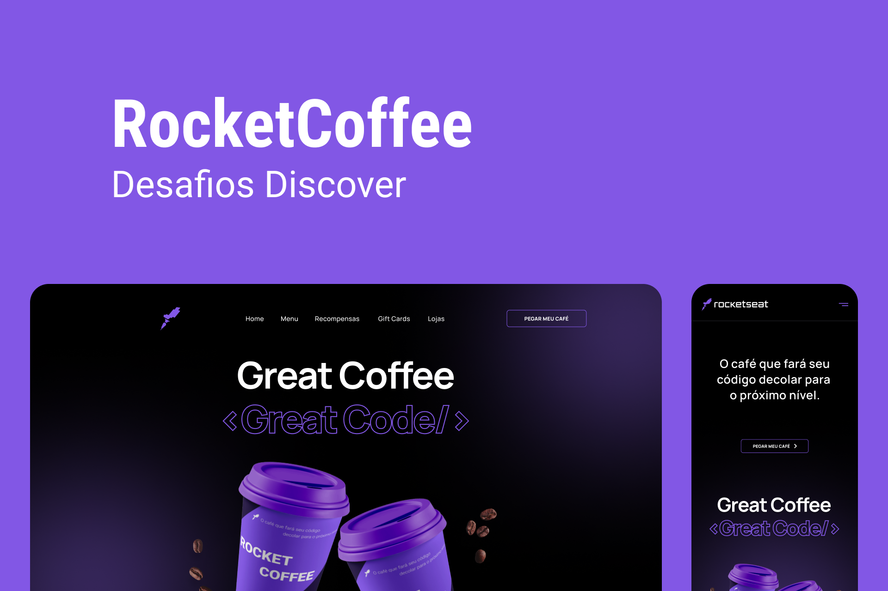
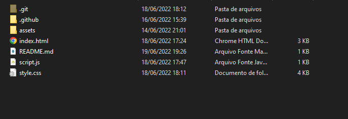
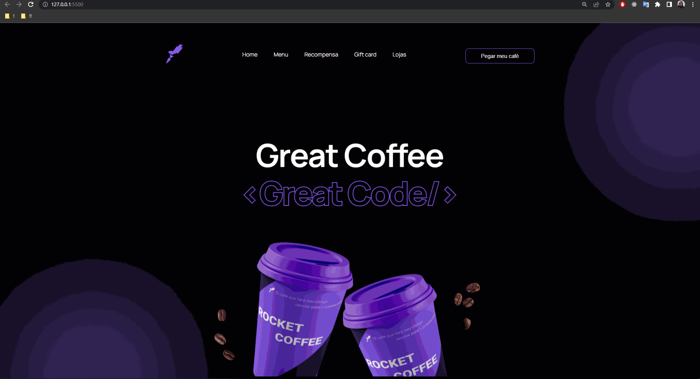

<h1 align="center">☕ RocketCoffee ☕</h1>



## Requisitos

### Para iniciar o projeto você ira precisa do <a href="https://git-scm.com/downloads">git</a>

## Clonando o projeto,em qualquer terminal clone o projeto

```bash
git clone https://github.com/rafaelmasselli/FrontEnd-Coffee
```

## Inicializando o projeto

> Entre na pasta do projeto

> Aperte no index.html



> E assim ira abrir o projeto




## 🔖 Layout

Você pode visualizar o layout do projeto através do link abaixo:

- [Layout Web]([https://www.figma.com/community/file/1009824839797878169/Letmeask](https://www.figma.com/file/LAxzjaZhTv69n7LAJeBktU/RocketCoffee-Copy?fuid=1086321388253863819))

Lembrando que você precisa ter uma conta no [Figma](http://figma.com/).

## Ferramentas usadas no projeto

- [x] HTML
- [x] CSS
- [x] JavaScript
